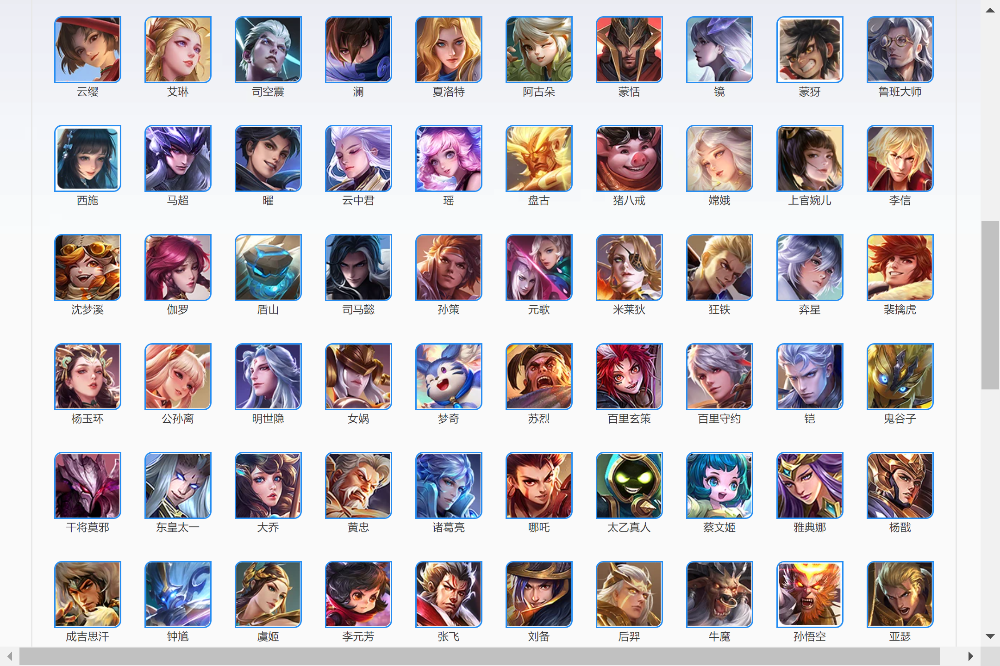
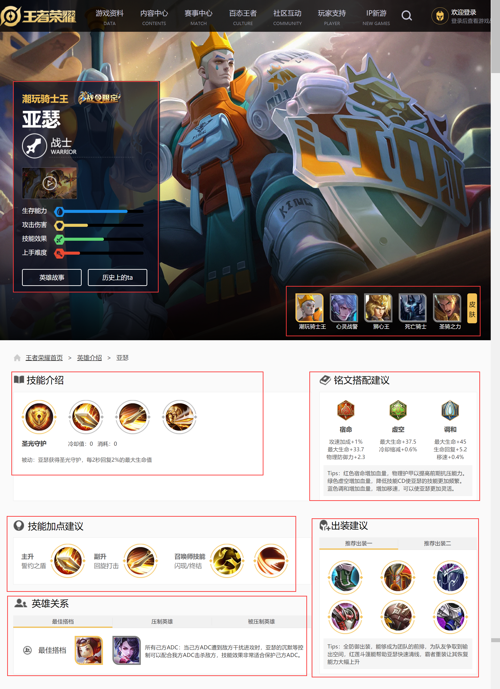

# 王者荣耀英雄信息采集
>采集方法:

- 通过 `herolist.json` 获取所有英雄信息

- `BeautifulSoup + html.parser`
- `selenium + lxml.etree.HTML`

### 项目背景

  **网站**：王者荣耀官网 - 游戏资料 - 英雄资料
  
  **URL**:  https://pvp.qq.com/web201605/herolist.shtml
  
  **json**: https://pvp.qq.com/web201605/js/herolist.json

### 项目任务

  获取所有英雄的信息

### 运行方法

直接运行`python main.py`即可

>注意：由于采用`selenium`库采集数据，所以在爬取过程中对内存消耗非常大。